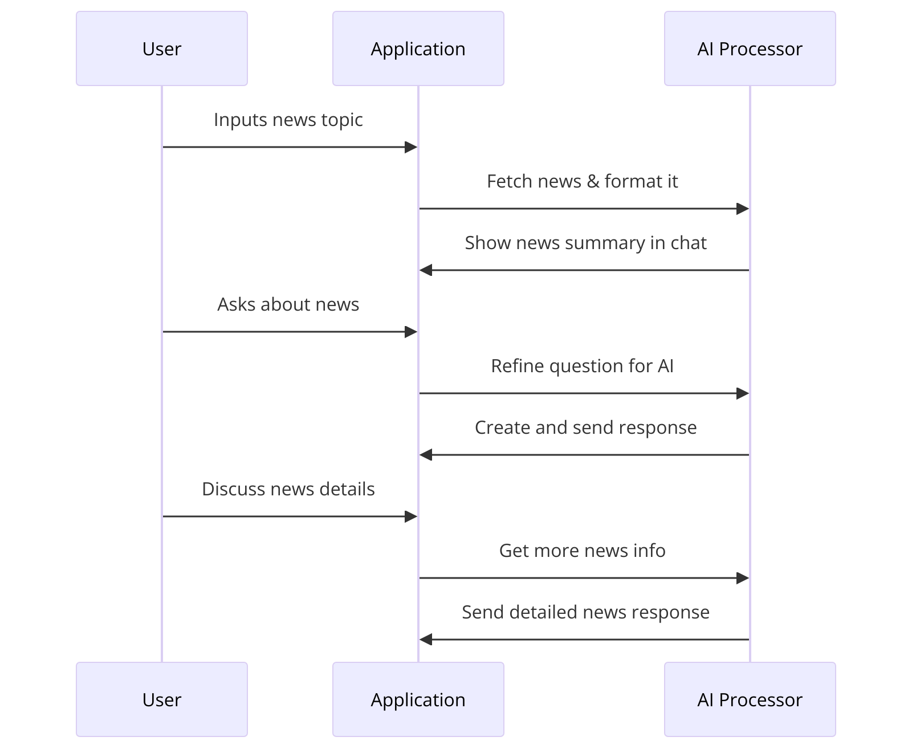

# News-App

News-App is a personal project designed to empower users to explore the latest news and engage in insightful conversations with a chatbot about their favorite news topics.

## Demo
Try it now: [News-App Demo](https://news-app-frontend-test.s3.eu-west-1.amazonaws.com/index.html)

## Features
- **News Search**: Search for news articles by keywords.
- **Chat with Chatbot**: Initiate informative conversations with a chatbot to discuss news topics.
- **Intelligent Chatbot**: Powered by OpenAI API for human-like responses.
- **User-Friendly Interface**: Designed using Angular for an intuitive user experience.
- **Serverless Deployment**: Built with the Serverless Framework, enabling efficient deployment on AWS.

## Tech Stack
- **Frontend**: Angular
- **Backend**: Serverless Framework
- **APIs**:
    - News API (for news search)
    - OpenAI API (for chatbot capabilities)
- **Cloud Services**: AWS

## How it Works
1. News Retrieval: The application fetches news based on the user's input.
2. Context Creation: Converts the news data into a contextual format.
3. News Summary: Displays a summary of the news in the chat interface.
4. User Inquiry: The user asks a question related to the news.
5. Question Refinement: The application uses an LLM to rephrase the question for better suitability.
6. Answer Generation: The application employs an LLM to formulate a response and sends it to the user.
7. Interactive Discussion: The user can engage in a conversation with the app about the specific news.
8. Data Scraping and Response: The app scrapes detailed data from the news URL and continues the response process as in steps 5 and 6.

### App Workflow

